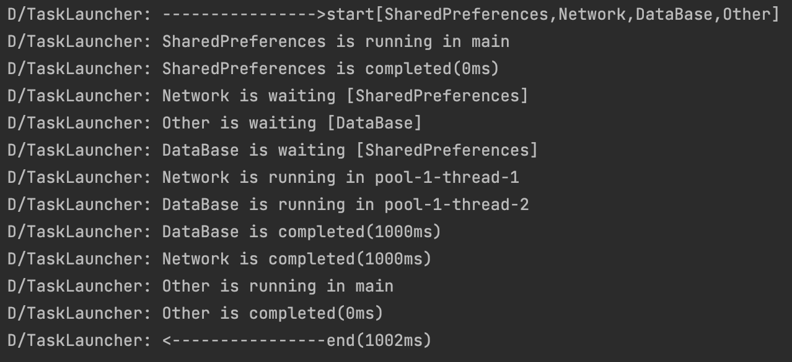

# Android-Task-Launcher
Android初始化任务启动器，支持异步任务，自动管理任务依赖关系。

[下载地址](https://github.com/zrheasy/Android-Task-Launcher/releases/download/v1.0.0/task-launcher-v1.0.aar)



### 使用步骤
#### 1.下载AAR并添加到项目中。
```groovy
implementation fileTree(dir: 'libs', include: ['*.jar','*.aar'])
```

#### 2.创建TaskLauncher。
```kotlin
val launcher = TaskLauncher()
launcher.setLogger { tag, msg -> Log.d(tag, msg) }
```

#### 3.创建Task并添加到TaskLauncher中。
```kotlin
// 方式1：继承Task实现抽象方法
class MyTask(launcher: TaskLauncher):Task(launcher){
    override fun isMainThread(): Boolean {
        TODO("Not yet implemented")
    }

    override fun getTaskId(): String {
        TODO("Not yet implemented")
    }

    override fun dependencies(): MutableSet<String> {
        TODO("Not yet implemented")
    }

    override fun onExecute() {
        TODO("Not yet implemented")
    }
}
launcher.addTask(MyTask(launcher))

// 方式2：使用TaskLauncher的addMainTask()或addAsyncTask()
launcher.addMainTask("SharedPreferences", emptySet()) {}
launcher.addAsyncTask("DataBase", setOf("SharedPreferences")) {
    Thread.sleep(1000)
}
```

#### 4.最后启动TaskLauncher。
```kotlin
launcher.start()
```